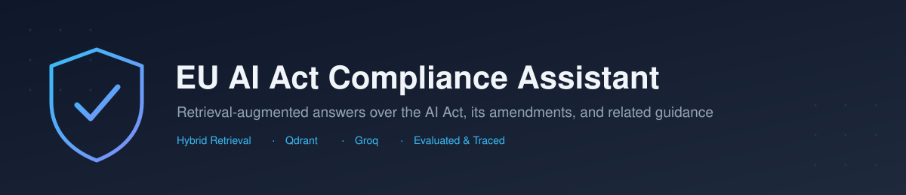

<p align="center">
  
</p>

<p align="center">
  <a href="https://github.com/sumit-sp/RAG_Pipeline/actions/workflows/eval.yml"></a>
  
  
  
</p>

A retrieval-augmented generation (RAG) system that answers questions about obligations under the **EU AI Act** (Regulation (EU) 2024/1689) — grounded across the core Regulation, its Digital Omnibus amendment, Commission guidance, Codes of Practice, and the GDPR — with citations back to source.

Built as a portfolio project demonstrating evaluation discipline (every quality claim backed by a measured score, not a vibe), production awareness (tracing, CI-gated eval), and documented trade-off decisions.

## Highlights

- **Hybrid retrieval** (dense + BM25, RRF fusion) + contextual chunk headers + a corpus-aware cross-reference boost that pulls in related documents (e.g. GDPR) when a chunk implicitly points to them.
- **97.6% retrieval-hit rate** (40/41 golden-set questions) on the current best config — and a from-scratch **qrels file** giving deterministic, LLM-free Precision/Recall/F1 on top of that.
- **Full evaluation trail**: every change shipped with a before/after number, including reverted (negative) results — see [`EVALUATION_HISTORY.md`](EVALUATION_HISTORY.md).
- Runs against **Qdrant Cloud** or a local embedded store with a one-line config change; generation via **Groq**-hosted open models; tracing via **Langfuse**.

## Quickstart

```bash
python -m venv .venv && source .venv/Scripts/activate   # Git Bash; use Activate.ps1 on PowerShell
pip install -r requirements.txt
cp .env.example .env            # set GROQ_API_KEY at minimum

python -m app.pipelines.plain.ingestion   # build the vector store
uvicorn app.api.main:app --port 8000      # API
streamlit run demo/app.py                 # demo UI, in a separate terminal
```

```bash
curl -s -X POST http://127.0.0.1:8000/query \
  -H "Content-Type: application/json" \
  -d '{"question": "When do Annex III high-risk AI system obligations become applicable?"}'
```

## Documentation

| Doc | What's in it |
|---|---|
| [`docs/PROJECT_OVERVIEW.md`](docs/PROJECT_OVERVIEW.md) | Full write-up: architecture diagram, repo layout, config reference, results table |
| [`EVALUATION_HISTORY.md`](EVALUATION_HISTORY.md) | Step-by-step story of every retrieval/generation change and its measured impact |
| [`DECISIONS.md`](DECISIONS.md) | Why things were built the way they were, including reverted approaches |
| [`PROGRESS.md`](PROGRESS.md) | Phase-by-phase task log against `RAG_PORTFOLIO_SPEC.md` |
| [`DEPLOYMENT.md`](DEPLOYMENT.md) | Environment variables, hosting steps, known gotchas |

## Status

Phase 3 (retrieval & generation quality) in progress; not yet deployed. Not legal advice.
