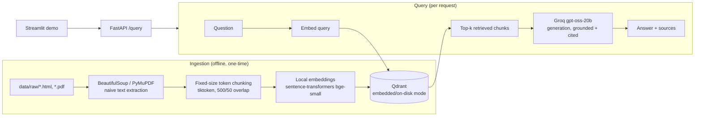

# EU AI Act Compliance Assistant

> **Status:** Phase 2 of the build spec complete (eval harness + baseline). Not yet deployed. See [`PROGRESS.md`](PROGRESS.md) for the detailed phase-by-phase log and [`DECISIONS.md`](DECISIONS.md) for why things were built the way they were. This README is kept up to date as the project progresses, rather than written once at the end.

## What this is

A retrieval-augmented generation (RAG) system that answers questions about obligations under the EU AI Act (Regulation (EU) 2024/1689) — e.g. "which obligations apply to my AI system, and when." It retrieves from a corpus spanning the core Regulation, the Digital Omnibus amendment, supporting Commission guidance and Codes of Practice, and the GDPR, and answers with citations back to the source documents.

## Who it's for

Built as a portfolio project demonstrating senior/lead-level AI engineering judgment: evaluation discipline (every quality claim backed by a golden-set score, not a vibe), production awareness (tracing, CI-gated eval, deployed and reachable, not just a local demo), and documented trade-off decisions (see `DECISIONS.md`). It's aimed at engineers and hiring managers evaluating RAG-system design skill, not at providing actual legal advice.

## Why this domain

GPAI transparency obligations became enforceable with real fines on 2 August 2026, and the high-risk-system timeline was just restructured by the "Digital Omnibus" amendment (in force since 27 July 2026). The corpus spans multiple distinct, cross-referencing documents rather than one regulation that fits in a single context window, and it includes a genuine, checkable versioning challenge: the Omnibus amendment changed dates written into the original Regulation (confirmed directly from the primary source text — see `DECISIONS.md` and `eval/golden_set.jsonl` items 1-6), which is a real test of whether the system surfaces the current obligation or a stale one.

## Architecture (current — Phase 1/2)



A full architecture diagram with the Phase 3/4 additions (hybrid search, reranking, cross-reference metadata) will replace this as those phases land.

- **Ingestion / Retrieval / Generation** are built behind shared interfaces (`app/core/interfaces.py`) so the `plain` (hand-rolled) backend and a future `langchain` backend (Phase 6) are swappable via `PIPELINE_BACKEND`.
- **No Docker required for local development.** Qdrant runs in `qdrant-client`'s embedded/on-disk mode (`qdrant_local_data/`) — the same client API as a real Qdrant server, so pointing at a Dockerized or hosted Qdrant later is just setting `QDRANT_URL`.
- **Embeddings run locally** (no API key) via sentence-transformers, behind an `Embedder` protocol so swapping to a hosted provider (OpenAI/Voyage/Cohere) later is a new class, not a rewrite.
- **Generation and eval-judging use Groq** (`gpt-oss-20b` for answers, the larger `gpt-oss-120b` as an independent DeepEval judge) — see `DECISIONS.md` for why.

## Repo structure

```
app/
├── core/            # Ingestor/Retriever/Generator/Embedder interfaces + shared models/config
├── pipelines/plain/  # hand-rolled backend (Phases 1-5)
├── pipelines/langchain/  # Phase 6, not built yet
└── api/             # FastAPI app
eval/                # golden set, DeepEval harness, results
demo/                # Streamlit UI
data/raw/            # source corpus (see data/raw/SOURCES.md)
```

## Requirements

- Python 3.13
- A [Groq](https://console.groq.com) API key (free tier is enough) — used for generation and eval judging
- No Docker, no other API keys needed for local development

## Local setup

```bash
python -m venv .venv
source .venv/Scripts/activate   # Windows Git Bash; use .venv\Scripts\Activate.ps1 for PowerShell
pip install -r requirements.txt
cp .env.example .env            # then edit .env and set GROQ_API_KEY
```

Ingest the corpus into the local vector store (run once, or again any time `data/raw/` changes):

```bash
python -m app.pipelines.plain.ingestion
```

Run the API:

```bash
uvicorn app.api.main:app --host 127.0.0.1 --port 8000
```

Run the demo UI in a separate terminal:

```bash
streamlit run demo/app.py
```

Open `http://localhost:8501`, or query the API directly:

```bash
curl -s -X POST http://127.0.0.1:8000/query \
  -H "Content-Type: application/json" \
  -d '{"question": "When do Annex III high-risk AI system obligations become applicable?"}'
```

## Configuration

All config is via environment variables (see `.env.example`). Key ones:

| Variable | Default | Notes |
|---|---|---|
| `GROQ_API_KEY` | *(required)* | Used for generation and eval judging |
| `GENERATION_MODEL` | `openai/gpt-oss-20b` | Swap to `openai/gpt-oss-120b` to compare quality/cost |
| `EMBEDDING_BACKEND` | `local` | Only `local` is implemented so far |
| `PIPELINE_BACKEND` | `plain` | Only `plain` is implemented so far (Phase 6 adds `langchain`) |
| `QDRANT_URL` | *(unset)* | Set this to use a real Qdrant server (e.g. via `docker-compose.yml`) instead of embedded/on-disk mode |
| `QDRANT_PATH` | `./qdrant_local_data` | Used only when `QDRANT_URL` is unset |

## Running the eval suite

```bash
pytest eval/run_eval.py -v
```

Scores each question in `eval/golden_set.jsonl` on faithfulness, answer relevancy, contextual precision, and contextual recall (threshold 0.5), by actually running retrieval + generation live and judging the result with Groq `gpt-oss-120b`. See `eval/results.md` for the latest baseline numbers.

Note: `deepeval test run eval/run_eval.py` (DeepEval's own CLI wrapper) is what CI uses, but it hangs indefinitely on at least one network we tested from (looks like a blocked telemetry call) — plain `pytest` runs the identical suite and is what's used for local development.

## Deployment guide (Render or Railway)

**Not yet done for this project** (tracked in `PROGRESS.md`) — these are the steps to follow when ready, for whoever ends up deploying it.

**Prerequisites:**
- Code pushed to a GitHub repo (Render/Railway both deploy via GitHub-connected auto-deploy)
- A Groq API key, added as a secret/env var on the platform (never commit it)

**Important caveat — the embedded Qdrant mode:** local dev uses `qdrant-client`'s on-disk mode, which writes to the container's local filesystem. Most PaaS free tiers (Render, Railway) use **ephemeral disks** — that data is wiped on every redeploy/restart. Two options:
1. **Simplest for a demo:** re-run ingestion as part of every deploy (see build command below), so the index rebuilds fresh each time. Fine for an 8-document corpus that ingests in well under a minute.
2. **More production-realistic:** point `QDRANT_URL` at a persistent Qdrant (Qdrant Cloud's free tier, or a Qdrant instance on a platform with a persistent volume/disk) so the index survives redeploys and doesn't need re-ingesting on every deploy.

### Deploying the API (Render)
1. Push this repo to GitHub.
2. Render dashboard → New → Web Service → connect the GitHub repo.
3. Build command: `pip install -r requirements.txt && python -m app.pipelines.plain.ingestion` (see caveat above; drop the ingestion part if using option 2).
4. Start command: `uvicorn app.api.main:app --host 0.0.0.0 --port $PORT`
5. Add environment variables in the Render dashboard: `GROQ_API_KEY`, `GENERATION_MODEL`, `EMBEDDING_BACKEND=local`, `PIPELINE_BACKEND=plain`, and `QDRANT_URL` if using option 2.
6. Deploy, then note the public URL Render assigns.

### Deploying the demo (Render, second service)
1. Same repo, new Render Web Service.
2. Build command: `pip install -r requirements.txt`
3. Start command: `streamlit run demo/app.py --server.port $PORT --server.address 0.0.0.0`
4. Environment variable: `API_URL=<the FastAPI service's public URL from above>`

### Railway
Same shape, different dashboard: New Project → Deploy from GitHub repo → Railway auto-detects Python; set the same build/start commands and environment variables per service in the Railway dashboard. Deploy the API and the demo as two separate services within the same Railway project, same `API_URL` wiring as above.

### GitHub Actions CI
Once pushed to GitHub, add `GROQ_API_KEY` as a repository secret (Settings → Secrets and variables → Actions) so `.github/workflows/eval.yml` can run the eval suite on every push.

## Results so far

Baseline eval (Phase 2, plain backend, no retrieval/generation tuning yet — full detail in `eval/results.md`):

| Metric | Mean score | Pass rate (threshold 0.5) |
|---|---|---|
| Faithfulness | 0.952 | 97% |
| Answer Relevancy | 0.977 | 100% |
| Contextual Precision | 0.759 | 82% |
| Contextual Recall | 0.752 | 87% |

26/41 golden-set questions (63%) pass all four metrics simultaneously. Generation quality is already strong; retrieval — specifically on cross-reference questions that need chunks from two different documents at once (0.63 precision / 0.54 recall vs. 0.82/0.79 for single-hop) — is the clear bottleneck and the concrete target for Phase 3 (hybrid search, reranking).

## Known limitations / failure modes

- **Cross-document retrieval is weak.** Dense-only top-k search tends to pull chunks from whichever single document is the closest semantic match, so questions needing two documents at once (e.g. an AI Act obligation and its GDPR counterpart) score worse on contextual precision/recall than single-hop questions. See `eval/results.md`.
- **2 of 41 eval questions get an empty generation response from Groq** (both about the GPAI Safety & Security Code of Practice chapter) and error out of scoring rather than just scoring low. Not yet root-caused; `PlainGenerator` doesn't currently handle an empty/`None` LLM response explicitly.
- No reranking, hybrid search, or query rewriting yet (Phase 1/2 baseline, as specced).
- No prompt-injection defense yet (Phase 5 deliverable).
- This section will keep growing as Phase 3/4 surface more, and gets finalized in Phase 5.
