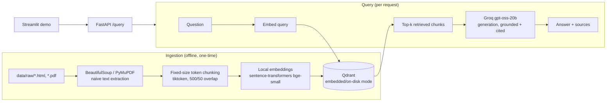

# EU AI Act Compliance Assistant

> **Status:** Phase 3 in progress (retrieval & generation quality). Not yet deployed. See [`EVALUATION_HISTORY.md`](../EVALUATION_HISTORY.md) for the full step-by-step story of how the eval numbers evolved, [`PROGRESS.md`](../PROGRESS.md) for the phase-by-phase task log, and [`DECISIONS.md`](../DECISIONS.md) for why things were built the way they were. This document is kept up to date as the project progresses, rather than written once at the end.
>
> This is the full project write-up. For a short overview, see the [repo README](../README.md).

## What this is

A retrieval-augmented generation (RAG) system that answers questions about obligations under the EU AI Act (Regulation (EU) 2024/1689) — e.g. "which obligations apply to my AI system, and when." It retrieves from a corpus spanning the core Regulation, the Digital Omnibus amendment, supporting Commission guidance and Codes of Practice, and the GDPR, and answers with citations back to the source documents.

## Who it's for

Built as a portfolio project demonstrating senior/lead-level AI engineering judgment: evaluation discipline (every quality claim backed by a golden-set score, not a vibe), production awareness (tracing, CI-gated eval, deployed and reachable, not just a local demo), and documented trade-off decisions (see `DECISIONS.md`). It's aimed at engineers and hiring managers evaluating RAG-system design skill, not at providing actual legal advice.

## Why this domain

GPAI transparency obligations became enforceable with real fines on 2 August 2026, and the high-risk-system timeline was just restructured by the "Digital Omnibus" amendment (in force since 27 July 2026). The corpus spans multiple distinct, cross-referencing documents rather than one regulation that fits in a single context window, and it includes a genuine, checkable versioning challenge: the Omnibus amendment changed dates written into the original Regulation (confirmed directly from the primary source text — see `DECISIONS.md` and `eval/golden_set.jsonl` items 1-6), which is a real test of whether the system surfaces the current obligation or a stale one.

## Architecture (current — Phase 1/2)



A full architecture diagram with the Phase 3/4 additions (hybrid search, reranking, cross-reference metadata) will replace this as those phases land.

- **Ingestion / Retrieval / Generation** are built behind shared interfaces (`app/core/interfaces.py`) so the `plain` (hand-rolled) backend and a future `langchain` backend (Phase 6) are swappable via `PIPELINE_BACKEND`.
- **No Docker required for local development.** Qdrant runs in `qdrant-client`'s embedded/on-disk mode (`qdrant_local_data/`) — the same client API as a real Qdrant server, so pointing at a Dockerized or hosted Qdrant later is just setting `QDRANT_URL`.
- **Embeddings run locally** (no API key) via sentence-transformers, behind an `Embedder` protocol so swapping to a hosted provider (OpenAI/Voyage/Cohere) later is a new class, not a rewrite.
- **Generation and eval-judging use Groq** (`gpt-oss-20b` for answers, the larger `gpt-oss-120b` as an independent DeepEval judge) — see `DECISIONS.md` for why.

## Repo structure

```
app/
├── core/            # Ingestor/Retriever/Generator/Embedder interfaces + shared models/config
├── pipelines/plain/  # hand-rolled backend (Phases 1-5)
├── pipelines/langchain/  # Phase 6, not built yet
└── api/             # FastAPI app
eval/                # golden set, DeepEval harness, results
demo/                # Streamlit UI
data/raw/            # source corpus (see data/raw/SOURCES.md)
```

## Requirements

- Python 3.13
- A [Groq](https://console.groq.com) API key (free tier is enough) — used for generation and eval judging
- No Docker, no other API keys needed for local development

## Local setup

```bash
python -m venv .venv
source .venv/Scripts/activate   # Windows Git Bash; use .venv\Scripts\Activate.ps1 for PowerShell
pip install -r requirements.txt
cp .env.example .env            # then edit .env and set GROQ_API_KEY
```

Ingest the corpus into the local vector store (run once, or again any time `data/raw/` changes):

```bash
python -m app.pipelines.plain.ingestion
```

Run the API:

```bash
uvicorn app.api.main:app --host 127.0.0.1 --port 8000
```

Run the demo UI in a separate terminal:

```bash
streamlit run demo/app.py
```

Open `http://localhost:8501`, or query the API directly:

```bash
curl -s -X POST http://127.0.0.1:8000/query \
  -H "Content-Type: application/json" \
  -d '{"question": "When do Annex III high-risk AI system obligations become applicable?"}'
```

## Configuration

All config is via environment variables (see `.env.example`). Key ones:

| Variable | Default | Notes |
|---|---|---|
| `GROQ_API_KEY` | *(required)* | Used for generation and eval judging |
| `GENERATION_MODEL` | `openai/gpt-oss-20b` | Swap to `openai/gpt-oss-120b` to compare quality/cost |
| `EMBEDDING_BACKEND` | `local` | Only `local` is implemented so far |
| `PIPELINE_BACKEND` | `plain` | Only `plain` is implemented so far (Phase 6 adds `langchain`) |
| `QDRANT_URL` | *(unset)* | Set this to use a real Qdrant server (e.g. via `docker-compose.yml`) instead of embedded/on-disk mode |
| `QDRANT_PATH` | `./qdrant_local_data` | Used only when `QDRANT_URL` is unset |
| `RETRIEVAL_MODE` | `hybrid` | `dense` (Phase 1 baseline) or `hybrid` (dense + BM25 sparse, current best — see `eval/results.md`). Each mode ingests into its own Qdrant collection. |
| `USE_RERANKING` | `false` | Cross-encoder reranking on top of whichever `RETRIEVAL_MODE` is active. Tried and reverted (see `DECISIONS.md`) — left available but off by default. |

## Running the eval suite

```bash
pytest eval/run_eval.py -v
```

Scores each question in `eval/golden_set.jsonl` on faithfulness, answer relevancy, contextual precision, and contextual recall (threshold 0.5), by actually running retrieval + generation live and judging the result with Groq `gpt-oss-120b`. See `eval/results.md` for the latest baseline numbers.

Note: `deepeval test run eval/run_eval.py` (DeepEval's own CLI wrapper) is what CI uses, but it hangs indefinitely on at least one network we tested from (looks like a blocked telemetry call) — plain `pytest` runs the identical suite and is what's used for local development.

## Deployment guide

**Not yet done for this project** (tracked in `PROGRESS.md`). Full step-by-step instructions — environment variables, Render/Railway steps, the ephemeral-vs-persistent Qdrant trade-off, Langfuse Cloud setup, and a known CI gap — are in **[`DEPLOYMENT.md`](../DEPLOYMENT.md)**, kept current with whatever the validated best pipeline config actually is (currently: hybrid retrieval + contextual chunk headers + the cross-reference boost — see `EVALUATION_HISTORY.md`).

## Results so far

Current best (Phase 3, hybrid retrieval — dense + BM25 sparse, RRF fusion), measured across
component/pipeline/application-level checks: **24/41 golden-set questions (59%) pass all six
checks simultaneously.** **For the full step-by-step story — starting point, each change tried,
and its measured impact — see [`EVALUATION_HISTORY.md`](../EVALUATION_HISTORY.md).** Raw numbers in
`eval/results.md`, rationale in `DECISIONS.md`.

| Check | Level | Mean / rate | Pass rate |
|---|---|---|---|
| Retrieval hit (expected doc retrieved) | Component (retriever), reference-based | 80% | 33/41 |
| Faithfulness | Pipeline, LLM-judge | 0.951 | 95% |
| Answer Relevancy | Pipeline, LLM-judge | 0.947 | 98% |
| Contextual Precision | Pipeline, LLM-judge | 0.772 | 85% |
| Contextual Recall | Pipeline, LLM-judge | 0.821 | 83% |
| Answer Correctness (vs. golden answer) | Application, LLM-judge | 0.751 | 80% |

Note: identical-config re-runs of this suite show real run-to-run variance (~0.05-0.07 per metric, since served LLM inference isn't bit-exact even at `temperature=0`) — see `eval/results.md` before reading too much into any single decimal place. The overall pass/fail count is the more robust signal. Also note: 59% here isn't a quality drop from an earlier-reported 76% — that number used only the 4 pipeline-level metrics; adding the retrieval-hit and answer-correctness checks measures the same pipeline more completely, not a worse one.

**What's been tried:**
- ✅ **Kept:** hybrid search (dense + BM25). Pass rate 27/41 → 31/41 vs. dense-only. Dense embeddings miss exact-term matches (article numbers, defined terms) that BM25 catches, which particularly helps multi-hop and cross-reference questions.
- ❌ **Reverted:** cross-encoder reranking on top of hybrid. Pass rate dropped to 26/41 despite 2 of 4 metrics improving on average — a genuine regression, not just noise. `cross-encoder/ms-marco-MiniLM-L-6-v2` (general web passage ranking) appears to work against the hybrid retrieval's exact-term signal rather than refine it.

## Known limitations / failure modes

- **Multi-hop/cross-document retrieval is still the weakest area**, even after hybrid search meaningfully improved it. Questions needing chunks from two different documents at once (e.g. an AI Act obligation and its GDPR counterpart) remain harder than single-hop questions.
- **Retrieval sometimes finds a "good enough" chunk instead of the specific expected one** — a reference-based check found the literal expected source document missing from top-k on 8/41 questions (20%), even though several of those still scored acceptably on LLM-judged contextual metrics because a different, topically-similar chunk covered the same ground. Worth targeting directly in Phase 4 (e.g. cross-reference metadata linking related chunks across documents).
- **Found and fixed:** `gpt-oss` models occasionally exhausted their token budget on hidden reasoning tokens before emitting any answer (`finish_reason="length"`, empty content) — fixed with `max_completion_tokens=4096` + `reasoning_effort="low"` on every Groq call.
- No contextual chunk headers or chunk-size tuning tried yet.
- No prompt-injection defense yet (Phase 5 deliverable).
- This section will keep growing as Phase 3/4 surface more, and gets finalized in Phase 5.
